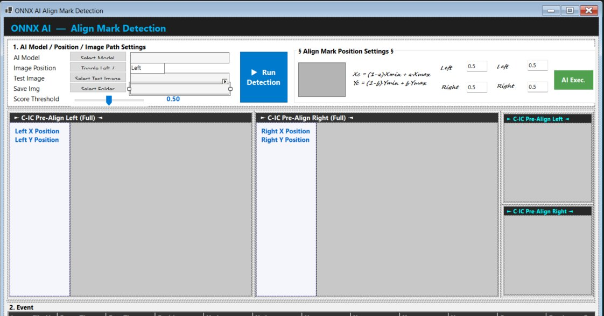
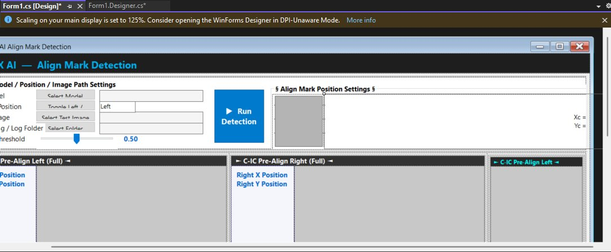
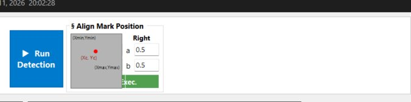

# ONNX AI — Align Mark Detection

A WinForms desktop application for testing YOLOv5 ONNX models on industrial camera images.  
Designed for align mark detection in manufacturing/display inspection environments.

---

## Screenshots

### Main Application UI



The main window showing the settings panel, Left/Right full image panels, crop panels, and the event log at the bottom.

---

### Visual Studio Designer View



The form as seen in Visual Studio 2022 Designer — all controls are editable visually through `Form1.Designer.cs`.

---

### Align Mark Position Settings (closeup)



The `§ Align Mark Position Settings §` group showing the bounding box preview diagram, the Xc/Yc formula, and the independent Left/Right a/b parameter inputs.

---

## Features

- **YOLOv5 ONNX inference** — load any `.onnx` model exported from YOLOv5
- **Left / Right camera support** — store and process both images independently
- **Adjustable a/b position parameters** — compute Xc/Yc anywhere inside the bounding box
- **Run Detection** — processes the currently selected side (Left or Right)
- **AI Exec** — processes both Left and Right sequentially in one click
- **Annotated results** — full image and zoomed crop both show bounding box, red dot, score, and coordinates
- **Event log** — every detection logged with timestamp, coordinates, score, and saved image path
- **Auto-save** — annotated images saved to a chosen folder after each run
- **Score threshold** — adjustable slider from 0.01 to 1.00
- **Real-time clock** — timestamp in the header updates every second

---

## Prerequisites

| Requirement | Version |
|-------------|---------|
| Windows | 10 or 11 |
| .NET SDK | 8.0 or later |
| Visual Studio | 2022 (Community or higher) |

---

## Getting Started

### 1. Project structure

```
OnnxDetectorApp/
├── Form1.cs              ← all logic (inference, events, UI handlers)
├── Form1.Designer.cs     ← all UI layout (edit in VS Designer)
├── Form1.resx
├── Program.cs
├── OnnxDetectorApp.csproj
└── screenshots/
    ├── app_main.png
    ├── app_designer.png
    └── align_mark_settings.png
```

### 2. Restore and run

```bash
cd OnnxDetectorApp
dotnet restore
dotnet run
```

Or open `OnnxDetectorApp.csproj` in Visual Studio 2022 and press **F5**.

---

## How to Use

### Step-by-step workflow

**1. Select Model**  
Click `Select Model (.onnx)` → choose your YOLOv5 exported `.onnx` file.

**2. Load images**  
- Toggle to `Left` → click `Select Test Image` → choose the left camera image  
- Toggle to `Right` → click `Select Test Image` → choose the right camera image  
- Both images are stored independently — switching position does not lose the other image.

**3. Set a/b parameters**  
In the `§ Align Mark Position Settings §` group:

| a | b | Result |
|---|---|--------|
| 0.5 | 0.5 | Centre of bounding box (default) |
| 0.0 | 0.0 | Top-left corner |
| 1.0 | 1.0 | Bottom-right corner |
| 0.5 | 0.0 | Top centre edge |
| 0.0 | 0.5 | Left edge, vertical centre |

Left and Right sides have independent a/b values.

**4. Run**  
- **▶ Run Detection** — runs inference on the currently active side only  
- **AI Exec** — runs inference on both Left and Right in sequence, using each side's own a/b values

**5. Read results**  
- Full image panel shows the annotated image with:
  - Green bounding box
  - Red dot at computed (Xc, Yc)
  - Score label above the box
  - Coordinate label next to the dot
- Crop panel shows a zoomed view of the detected region with all annotations
- X/Y position labels update with pixel coordinates
- Event log records every detection

**6. Save**  
Click `Select Folder` before running. Annotated `.jpg` images are saved automatically after each detection.

---

## Align Mark Position Formula

```
Xc = (1 - a) · Xmin  +  a · Xmax
Yc = (1 - b) · Ymin  +  b · Ymax
```

The bounding box from YOLO gives `Xmin, Ymin, Xmax, Ymax`.  
`a` and `b` control where within that box the final coordinate point is placed.  
This is useful when the physical align mark is not at the geometric centre of the detection box.

---

## ONNX Model Requirements

The app expects a standard **YOLOv5** ONNX export:

```bash
# Export from YOLOv5 repo
python export.py --weights best.pt --include onnx --imgsz 640
```

| Property | Value |
|----------|-------|
| Input tensor name | `images` |
| Input shape | `[1, 3, 640, 640]` |
| Output shape | `[1, num_boxes, 85]` |
| Output format | `x, y, w, h, obj_conf, class_scores...` |

If your model uses a different input size (e.g. 1280), change `inputW` / `inputH` at the top of `RunInference()` in `Form1.cs`.

---

## Building a Distributable EXE

From the VS Terminal (`View → Terminal`):

```bash
dotnet publish -c Release -r win-x64 --self-contained true -p:PublishSingleFile=true
```

Output location:
```
bin\Release\net8.0-windows\win-x64\publish\
```

Zip the **entire publish folder** — the exe, ONNX runtime DLLs, and the `runtimes\` subfolder are all required.

```powershell
Compress-Archive -Path "bin\Release\net8.0-windows\win-x64\publish\*" -DestinationPath "OnnxDetectorApp.zip"
```

Recipients just unzip and double-click — no .NET installation needed.

---

## NuGet Dependencies

| Package | Version | Purpose |
|---------|---------|---------|
| `Microsoft.ML.OnnxRuntime` | 1.18.0 | CPU inference engine |

For GPU (CUDA) support, replace with `Microsoft.ML.OnnxRuntime.Gpu` and update session creation in `Form1.cs`:

```csharp
using var session = new InferenceSession(modelPath,
    SessionOptions.MakeSessionOptionWithCudaProvider(0));
```

---

## Troubleshooting

| Problem | Fix |
|---------|-----|
| App crashes on launch | Ensure the `runtimes\` folder is present next to the exe |
| No detections | Lower the threshold slider; verify model input size matches `inputW`/`inputH` |
| Inference error | Confirm model was exported with `--include onnx` and input name is `images` |
| Left/Right images overwriting each other | Use Toggle button to switch sides before selecting each image |
| Images superimposed in crop panel | Clear view and reload — this is fixed in the current version |
| btnClearView not visible | In Designer.cs, set `btnClearView.Location` to a point within the form width |

---

## Roadmap

- **Batch mode** — drop a folder of images and process all automatically
- **CSV export** — save the event log as a `.csv` file  
- **Live camera feed** — replace file picker with USB/GigE camera stream using `AForge.NET` or `OpenCvSharp`
- **Pass/Fail verdict** — set coordinate tolerance bounds and flag out-of-range marks
- **Folder watcher** — auto-detect and process new images saved to a network path
- **Settings persistence** — save model path, threshold, and a/b values to a `config.json`
- **Multi-class support** — colour-code boxes per class label using a `labels.txt` file

---

## License

For internal use. Not for redistribution without permission.
